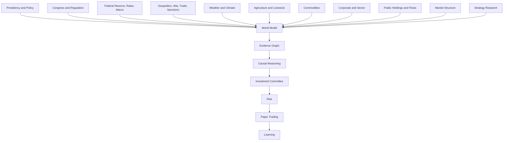

# Investment Intelligence OS
## System Map — v0.1

**Purpose:** Define how IIOS converts public information into an auditable paper decision and a learning record.

---

## 1. System Doctrine

IIOS is a staged decision system, not a single prompt and not a single trading model.

Each stage creates a durable artifact. Later stages may use earlier artifacts, but they may not silently replace them.

---

## 2. End-to-End Architecture

```mermaid
flowchart LR
    A[Official / Licensed Public Sources] --> B[Data Ingestion Engine]
    B --> C[Immutable Raw Store]
    B --> D[Canonical Events and Market Data]
    C --> E[Data Quality and Trust Scoring]
    D --> E
    E --> F[Entity Resolution and World Model]
    F --> G[Evidence Graph]
    G --> H[Causal Chain Engine]
    H --> I[Historical Analogs and Regime Engine]
    I --> J[Specialist Intelligence Agents]
    J --> K[Skeptic / Red Team]
    J --> L[Investment Committee]
    K --> L
    L --> M{Candidate Thesis?}
    M -->|No| N[No-Trade / Watch / Avoid]
    M -->|Yes| O[Portfolio and Risk Engine]
    O -->|Veto| N
    O -->|Approve| P[Paper Trading Engine]
    P --> Q[Paper Portfolio]
    N --> R[Decision Journal]
    Q --> R
    R --> S[Learning and Backtesting Engine]
    S --> T[Hypothesis / Model / Agent Updates]
    T --> F
    T --> J
```



---

## 3. Seven Operating Stages

| Stage | Core Question | Durable Artifacts |
|---|---|---|
| Observe | What happened, when, and from what source? | Raw payload, canonical event, market data, source trust score |
| Understand | What entities and economic relationships are implicated? | World-state snapshot, entity links, evidence graph, historical analogs |
| Reason | How could this transmit into markets, and what contradicts it? | Causal chain, counter-chain, assumptions, lags, falsifiers, missing information |
| Decide | Is there a thesis worth advancing? | Agent views, dissent, committee rationale, thesis score, horizon, catalysts, invalidation |
| Risk | How much risk, if any, is appropriate? | Position cap, concentration check, correlation check, liquidity check, veto or approval |
| Simulate | What would historical and paper execution look like? | Event study, backtest, paper order, fill, position, portfolio state |
| Learn | What was right or wrong, and why? | Postmortem, attribution, calibration, belief update, retired hypothesis |

---

## 4. Core Services

### Data Service

Owns:

- connectors;
- retrieval;
- raw records;
- parsing;
- normalization;
- deduplication;
- revisions;
- timestamps;
- source health;
- data quality.

Does not own:

- investment conclusions;
- position sizing;
- orders.

### Knowledge Service

Owns:

- entities;
- relationships;
- world state;
- evidence graph;
- source-to-claim linkage;
- historical analog index;
- policy lifecycle.

Does not own:

- final committee decisions;
- risk approval.

### Reasoning Service

Owns:

- causal chains;
- counter-chains;
- missing-information detection;
- assumption and falsifier tracking;
- thesis candidates;
- explainability.

Does not own:

- portfolio authority;
- live execution.

### Agent Service

Owns:

- bounded specialist analyses;
- structured outputs;
- evidence citations;
- confidence;
- abstention;
- dissent.

Does not own:

- risk limits;
- final accountability;
- autonomous live orders.

### Committee Service

Owns:

- aggregation;
- debate;
- unresolved questions;
- candidate/no-trade decision;
- committee rationale.

Does not own:

- position size;
- execution.

### Portfolio and Risk Service

Owns:

- exposure;
- sizing;
- correlation;
- concentration;
- liquidity;
- drawdown;
- kill switches;
- vetoes.

Does not own:

- source truth;
- causal claims.

### Paper Execution Service

Owns:

- simulated orders;
- fills;
- fees;
- spreads;
- slippage;
- positions;
- cash;
- accounting.

Does not own:

- thesis generation.

### Learning Service

Owns:

- backtests;
- event studies;
- strategy evaluation;
- agent calibration;
- postmortems;
- knowledge evolution;
- hypothesis retirement.

Does not silently change:

- production models;
- risk limits;
- constitutional controls.

### Command Center

Owns the presentation of:

- world state;
- event radar;
- opportunity board;
- committee view;
- risk state;
- paper portfolio;
- learning;
- data health;
- decision journal.

The command center is not a separate source of truth. It reads governed services.

---

## 5. Intelligence-Domain Map



Each domain may confirm, contradict, qualify, or delay another domain.

No domain receives automatic supremacy.

---

## 6. Agent Team

| Agent | Mandate | Must Not Do |
|---|---|---|
| Macro Analyst | Rates, inflation, labor, growth, liquidity, dollar, curve, regime | Treat one release as sufficient evidence |
| Policy Analyst | Presidency, Congress, regulation, trade, implementation state | Treat rhetoric as binding action or guaranteed market benefit |
| Geopolitical Analyst | Conflict, sanctions, trade routes, escalation scenarios | Produce one deterministic war forecast |
| Commodity and Weather Analyst | Agriculture, livestock, energy, metals, weather, seasonality, inventories | Ignore geography, crop calendars, substitution, or futures curves |
| Corporate and Sector Analyst | Filings, capex, guidance, relationships, peers, valuation | Treat relationships as proof of favorable treatment |
| Market Structure Analyst | Trend, breadth, volatility, liquidity, options and futures context | Override risk or invent fundamentals |
| Strategy Research Agent | Public strategies, public trades, bot behavior, academic evidence | Claim undisclosed logic is known exactly |
| Skeptic / Red Team | Attack causality, leakage, crowding, confounding, and confirmation bias | Optimize for agreement |
| Investment Committee | Aggregate views, preserve dissent, request missing evidence | Place orders directly |
| Risk Manager | Size or veto; control concentration, correlation, liquidity, and drawdown | Increase risk because language sounds confident |

---

## 7. Canonical Artifact Chain

```text
Source
  ↓
Raw Record
  ↓
Canonical Event / Market Data Point
  ↓
Evidence Object
  ↓
Claim
  ↓
Causal Chain + Counter-Chain
  ↓
Hypothesis
  ↓
Investment Thesis
  ↓
Committee Decision
  ↓
Risk Decision
  ↓
Paper Order / No-Trade
  ↓
Position and Outcome
  ↓
Postmortem
  ↓
Belief / Strategy / Agent Update
```

Any missing link invalidates the decision lineage.

---

## 8. Daily Operating Flow

### Pre-Market or Morning Run

1. Check source health.
2. Ingest new official and licensed data.
3. Normalize and deduplicate events.
4. Update world state and regimes.
5. Rank events by potential impact and novelty.
6. Generate evidence and causal chains.
7. Ask specialist agents for structured views.
8. Run skeptic review.
9. Convene committee.
10. Send candidates to risk.
11. Create paper orders or no-trade records.
12. Publish command-center briefing.

### Intraday

- Monitor scheduled catalysts.
- Update material events.
- Reevaluate invalidation conditions.
- Recalculate risk and exposure.
- Do not create hidden manual positions outside the journal.

### After Close

1. Reconcile paper accounting.
2. Record outcome changes.
3. Evaluate whether transmission behaved as expected.
4. Distinguish process quality from P&L.
5. Update hypotheses and confidence.
6. Record source, model, and operational failures.

---

## 9. System Boundaries

IIOS may recommend and simulate.

IIOS V1 may not:

- place autonomous live orders;
- use unapproved information;
- bypass risk;
- hide dissent;
- modify governing documents;
- promote strategies without evidence;
- continue normal operation through critical data failure.

---

## 10. Minimal Vertical Slice

The first system demonstration must trace one event from an official source through:

`source → event → evidence → world state → causal chain → macro/policy/skeptic views → committee → risk → paper order or no-trade → dashboard → journal`

The goal is not source breadth. The goal is proof that the complete loop works and is auditable.
