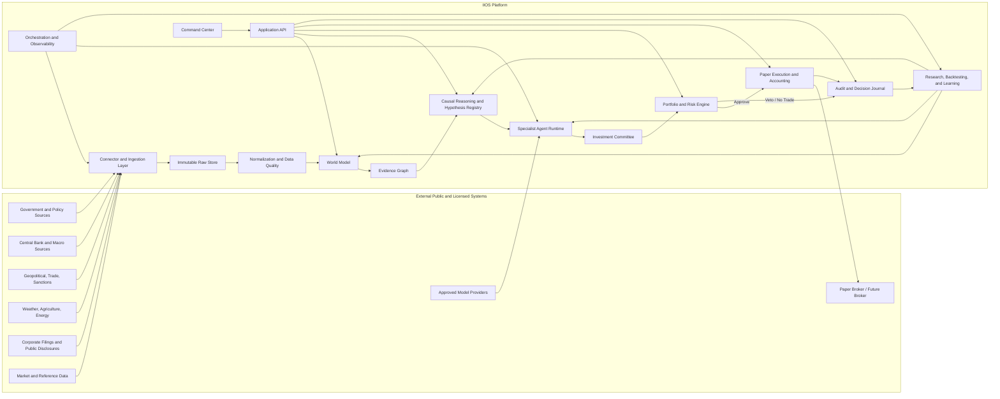
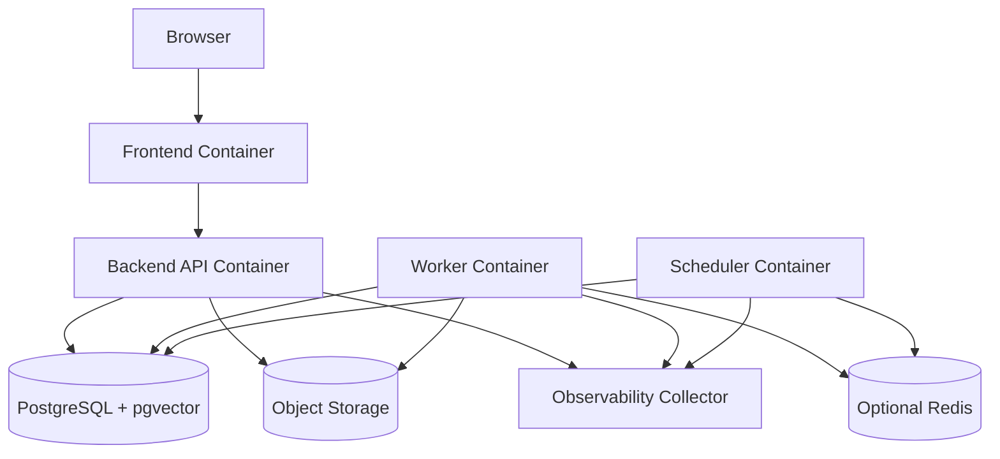

# Investment Intelligence OS
## Architecture Overview — v0.1

---

## 1. Executive Architecture

IIOS is a modular, event-driven investment-intelligence platform that converts lawful public or properly licensed information into auditable research decisions and paper trades.

V1 is implemented as a **modular monolith** rather than a collection of independent microservices. The modules have strict contracts and ownership boundaries, but share one backend codebase and one governed relational system of record.

This gives the project:

- fast local development;
- simple transactions;
- easier debugging;
- fewer network failure modes;
- complete audit lineage;
- a clean path to extract services later when measured scale requires it.

The runtime is separated into independently runnable processes:

- API;
- scheduled orchestration;
- background workers;
- frontend;
- PostgreSQL;
- object storage;
- optional transient cache and lock service;
- observability collector where enabled.

---

## 2. Architecture Goals

The architecture must optimize for:

1. **Point-in-time correctness**
2. **Evidence provenance**
3. **Safe failure**
4. **Deterministic risk enforcement**
5. **Bounded AI authority**
6. **Reproducible research**
7. **Vendor-neutral integrations**
8. **Low V1 operational complexity**
9. **Complete decision reconstruction**
10. **Future institutional evolution**

---

## 3. End-to-End System



---

## 4. Architectural Style

### V1 Style

**Modular monolith with asynchronous workers and an internal event model.**

Modules share:

- one repository;
- one deployment unit for backend code;
- one PostgreSQL cluster;
- one migration history;
- one configuration system;
- one audit model.

Modules do not share:

- undocumented database writes;
- hidden global state;
- unversioned schemas;
- direct authority outside their boundary.

### Why Not Microservices in V1

Microservices would add:

- network contracts before domain contracts are stable;
- distributed transactions;
- more credentials;
- more deployment surfaces;
- more failure modes;
- more monitoring;
- slower iteration.

Service extraction is permitted later only after a measured bottleneck or independent scaling requirement exists.

---

## 5. Core Architectural Layers

| Layer | Responsibility | Source of Truth |
|---|---|---|
| Acquisition | Retrieve official and licensed information | Raw record and connector checkpoint |
| Normalization | Convert source-specific data into canonical objects | Canonical event and market data |
| Knowledge | Resolve entities, relationships, and current state | Entity registry and world snapshots |
| Evidence | Attach support, contradiction, provenance, and quality | Evidence graph |
| Reasoning | Build causal chains, alternatives, hypotheses, and theses | Hypothesis registry |
| Intelligence | Produce bounded specialist analyses | Agent run and structured output |
| Decision | Aggregate views and preserve dissent | Committee decision |
| Risk | Enforce portfolio constraints and veto authority | Risk decision and portfolio state |
| Execution | Simulate orders, fills, fees, and positions | Paper ledger |
| Research | Test strategies and causal claims point-in-time | Research run registry |
| Learning | Attribute outcomes and update confidence | Postmortem and belief history |
| Experience | Present the system to the owner | Backend APIs, never browser-only logic |
| Platform | Schedule, observe, secure, back up, and recover | Operational ledgers and audit records |

---

## 6. Systems of Record

### PostgreSQL

PostgreSQL is the authoritative store for:

- metadata;
- canonical events;
- entities and relationships;
- evidence;
- hypotheses and theses;
- agent runs;
- committee and risk decisions;
- paper accounting;
- research metadata;
- model and prompt registry;
- audit events;
- job state.

### Object Storage

Object storage is authoritative for:

- immutable raw payloads;
- original documents;
- large extracted text;
- research artifacts;
- charts and reports;
- model input/output bundles when too large for relational storage;
- export and backup artifacts.

### Cache

Any cache is disposable.

It may improve:

- response speed;
- rate-limit coordination;
- short-lived locks;
- derived-query performance.

It may not become the only location for:

- a decision;
- a position;
- a source record;
- a job state;
- a risk limit;
- an audit event.

---

## 7. Operating Modes

| Mode | Purpose | Allowed |
|---|---|---|
| Development | Coding and unit testing | Synthetic data, fixtures, local models, no live orders |
| Test | Integration, replay, failure injection | Synthetic and replayed data, paper state only |
| Paper | Forward operating routine | Public/licensed data, real-time research, simulated execution |
| Live | Future controlled deployment | Disabled in V1 |

Mode is an explicit configuration value recorded on every order and decision.

A user-interface label is not sufficient protection. Backend authorization must reject live execution in V1.

---

## 8. Primary Data Path

```text
Connector
  → RawRecord
  → ParseResult
  → CanonicalEvent or MarketDataPoint
  → DataQualityAssessment
  → EntityResolution
  → WorldStateUpdate
  → EvidenceObject
  → Claim
  → CausalChain and CounterChain
  → Hypothesis
  → InvestmentThesis
  → AgentViews
  → CommitteeDecision
  → RiskDecision
  → PaperOrder or NoTrade
  → Fill and Position
  → Outcome
  → Postmortem
  → Calibration and BeliefUpdate
```

Every stage records input IDs, output IDs, code version, schema version, and time.

---

## 9. Critical Control Split

### Probabilistic Components

- relevance ranking;
- extraction assistance;
- entity-match suggestions;
- causal hypothesis generation;
- historical analog retrieval;
- agent interpretation;
- confidence estimation.

### Deterministic Components

- schema validation;
- timestamp rules;
- source permissions;
- data quarantine;
- position limits;
- exposure limits;
- order authorization;
- paper accounting;
- kill switches;
- environment restrictions;
- audit requirements.

Probabilistic components may propose. Deterministic components enforce.

---

## 10. Initial Deployment Shape



All backend processes run the same versioned application package with different entry points.

---

## 11. Architecture Quality Attributes

| Attribute | Required Behavior |
|---|---|
| Auditability | Any material decision can be reconstructed |
| Correctness | Point-in-time and accounting invariants are tested |
| Safety | Critical failures produce no-trade or stand-down |
| Explainability | Evidence, assumptions, dissent, and invalidation are visible |
| Reproducibility | Research runs have immutable manifests |
| Extensibility | Sources, models, brokers, and strategies use adapters |
| Maintainability | Modules have explicit ownership and dependency direction |
| Observability | Logs, metrics, traces, source health, and job state are correlated |
| Security | Least privilege, no committed secrets, controlled tools and sources |
| Scalability | Stateless processes scale horizontally before service extraction |
| Cost Control | Model, data, and compute usage are measured |
| Usability | One operator can understand the daily state in approximately ten minutes |

---

## 12. Architecture Non-Goals

V1 architecture does not optimize for:

- sub-millisecond latency;
- high-frequency trading;
- global multi-region active-active operation;
- thousands of simultaneous users;
- market making;
- direct exchange connectivity;
- autonomous self-modifying agents;
- unlimited data retention;
- immediate extraction into many microservices;
- a dedicated graph database without measured need;
- a separate vector database without measured need.

---

## 13. Definition of Architecture Success

Architecture is successful when the system can demonstrate one complete trace from source to postmortem, while:

- preserving point-in-time semantics;
- showing source and evidence lineage;
- producing a credible counter-case;
- preserving agent disagreement;
- enforcing risk;
- simulating realistic execution;
- reconciling accounting;
- failing safely;
- recording model and code versions;
- supporting replay.
