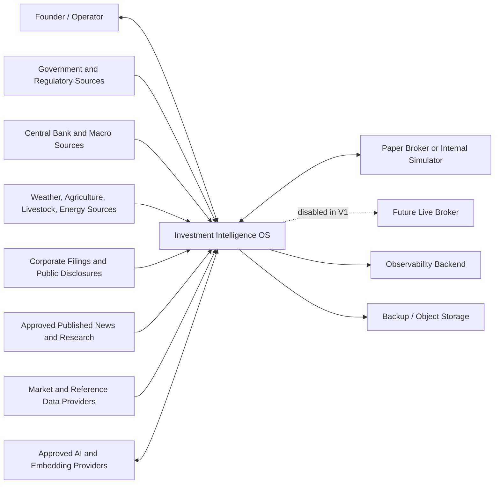
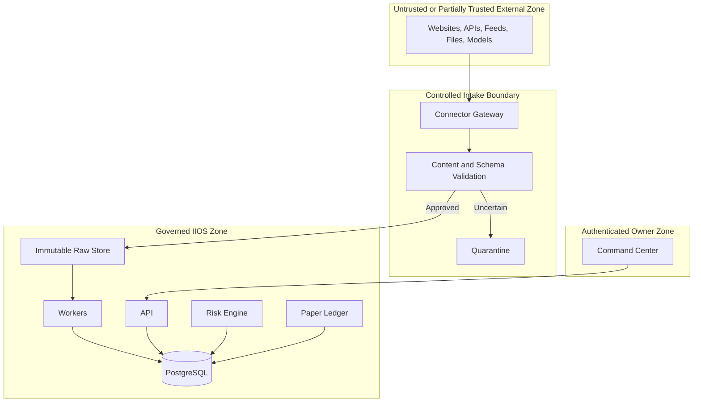

# Investment Intelligence OS
## System Context and Boundaries — v0.1

---

## 1. Context

IIOS sits between public or properly licensed information sources and a single owner/operator.

It observes and reasons about the world, but V1 does not autonomously move live capital.

---

## 2. System Context Diagram



---

## 3. Human Actors

### Founder / Operator

May:

- configure approved sources;
- start and inspect workflows;
- review decisions;
- approve architecture changes;
- create hypotheses;
- inspect paper orders;
- invoke stand-down;
- approve future promotions.

May not bypass immutable audit history.

### Future Researcher

Potential later role:

- create and test hypotheses;
- inspect source and research data;
- not change production risk limits.

### Future Risk Approver

Potential later role:

- approve limits;
- review exceptions;
- authorize risk changes;
- not alter source records.

### Future Compliance or Legal Reviewer

Potential later role:

- inspect data provenance;
- review information boundaries;
- approve permitted use;
- inspect audit evidence.

---

## 4. External System Classes

### Official Public Sources

Examples of source classes:

- presidency and executive actions;
- Congress;
- Federal Register;
- central bank;
- Treasury and sanctions;
- trade agencies;
- securities filings;
- agriculture;
- weather;
- energy;
- labor and macroeconomic releases.

Trust posture:

- primary evidence;
- still subject to parsing errors, revisions, delays, and implementation uncertainty.

### Published News and Research

Trust posture:

- useful for discovery, context, and corroboration;
- not automatically independent when multiple outlets repeat one original claim;
- lower precedence than the underlying official or primary source when available.

### Market and Reference Data

Trust posture:

- licensed or approved;
- timestamp semantics and adjustment policy documented;
- provider-specific identifiers mapped to canonical instruments.

### AI Model Providers

Trust posture:

- untrusted probabilistic processors;
- prompts and data sent only through approved gateways;
- output requires schema validation and evidence checks;
- no authority to change risk or execution state.

### Broker or Paper Simulator

Trust posture:

- paper integration in V1;
- future live adapters remain disabled;
- broker state is reconciled against IIOS state rather than blindly assumed correct.

---

## 5. Trust Boundaries



All external content is treated as untrusted input, including official documents.

---

## 6. In-Boundary Responsibilities

IIOS owns:

- connector configuration;
- retrieval and timestamping;
- raw preservation;
- normalization;
- provenance;
- source and data health;
- entity identity;
- world state;
- evidence linkage;
- causal hypotheses;
- agent orchestration;
- committee records;
- risk evaluation;
- paper accounting;
- research manifests;
- learning records;
- audit and observability.

---

## 7. Out-of-Boundary Responsibilities

V1 does not own:

- truth of external statements;
- legal validity of a policy;
- guaranteed implementation;
- market-data exchange licensing beyond documented provider terms;
- tax advice;
- legal advice;
- investment-adviser registration decisions;
- live broker custody;
- exchange clearing;
- guaranteed profitability;
- human accountability.

---

## 8. Prohibited Data and Action Paths

The architecture must reject:

```text
private tip → direct thesis
leaked or hacked material → ingestion
unverified source → authoritative fact
model output → direct order
committee confidence → direct leverage
browser value → portfolio ledger
stale critical feed → new risk
paper environment → live broker route
manual database edit → hidden position
```

---

## 9. Data Classification

| Class | Example | Handling |
|---|---|---|
| Public primary | Official government release | Raw capture, provenance, normal validation |
| Public secondary | Published news report | Link to original where possible; deduplicate narrative repetition |
| Properly licensed | Market data | Enforce rights, retention, and environment restrictions |
| Internal operational | Logs, decisions, paper positions | Authenticate, audit, back up |
| Confidential secret | API keys and tokens | Secret store only; never source control |
| Quarantined | Unknown provenance or rights | Exclude from analysis and decisions |
| Prohibited | MNPI, hacked, stolen, unauthorized | Do not retain or use except minimal incident metadata |

---

## 10. Network and Process Boundaries

V1 target boundaries:

- browser communicates only with the API;
- frontend does not connect directly to PostgreSQL;
- connectors run in worker processes;
- models are called through the Model Gateway;
- brokers are called through the Execution Adapter;
- object storage is accessed through a storage interface;
- database credentials differ by environment;
- worker permissions may exceed read-only UI permissions but remain bounded;
- future live credentials must not exist in development or paper environments.

---

## 11. Boundary Acceptance Tests

The architecture must prove:

- unauthorized source type is quarantined;
- an agent cannot write a paper order directly;
- browser-side manipulation cannot alter portfolio accounting;
- paper mode cannot call a live adapter;
- missing provenance blocks thesis promotion;
- stale critical data blocks new risk;
- a failed external model call leaves durable job state and no partial decision;
- a secret is not present in repository or logs.
