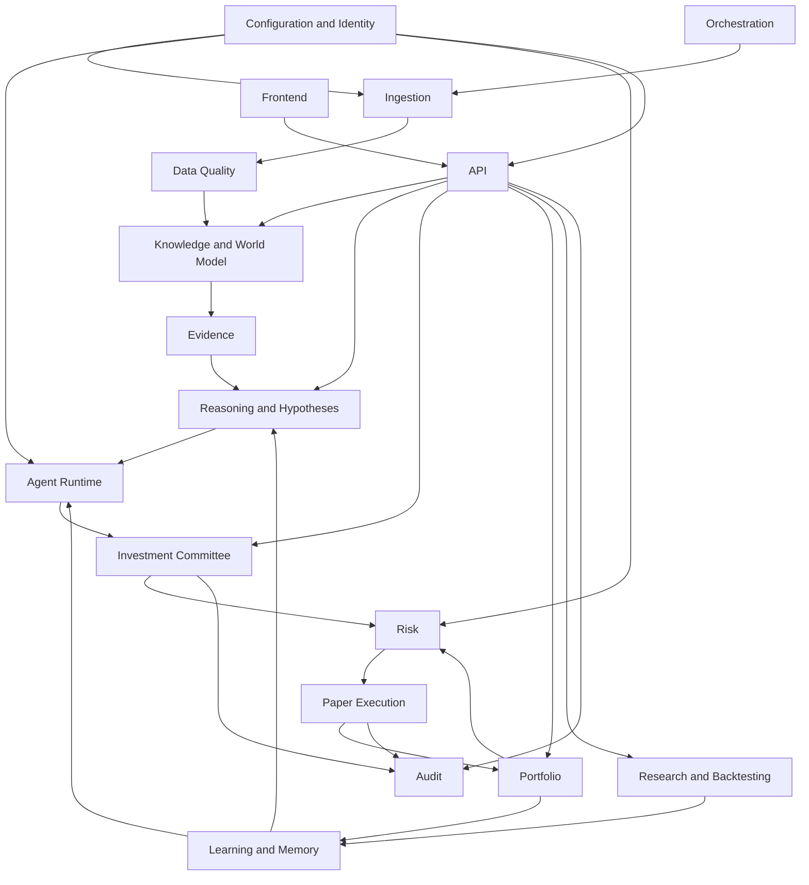

# Investment Intelligence OS
## Logical Component Model — v0.1

---

## 1. Component Strategy

IIOS uses domain modules inside a modular monolith.

Each module owns:

- domain objects;
- application services;
- repositories;
- invariants;
- events;
- authorization rules;
- tests.

Cross-module access occurs through typed application interfaces or domain events.

Direct cross-module table writes are prohibited.

---

## 2. Logical Component Diagram



---

## 3. Module Inventory

### Platform Module

Owns:

- environment mode;
- configuration;
- feature flags;
- IDs;
- clocks;
- serialization;
- common error types;
- transaction management;
- correlation IDs.

Must not contain investment logic.

### Identity and Access Module

Owns:

- user identity;
- sessions or tokens;
- roles and permissions;
- future tenant identity;
- audit identity.

### Source Registry Module

Owns:

- approved sources;
- source rights classification;
- connector configuration;
- expected freshness;
- trust policy;
- source ownership.

### Ingestion Module

Owns:

- connector interfaces;
- checkpoints;
- retrieval;
- raw-record creation;
- parsing;
- normalization;
- deduplication;
- revision detection.

### Data Quality Module

Owns:

- schema validation;
- freshness;
- completeness;
- anomaly checks;
- quarantine;
- source health;
- data-quality score.

### Market Data Module

Owns:

- instruments;
- symbology;
- calendars;
- bars, quotes, curves, rates, volatility, and corporate actions;
- adjustment policy;
- provider mapping.

### Knowledge Module

Owns:

- entity registry;
- aliases;
- entity resolution;
- relationships;
- world-state snapshots;
- policy lifecycle;
- regime state.

### Evidence Module

Owns:

- evidence objects;
- source-to-claim linkage;
- support and contradiction edges;
- evidence quality;
- citation bundles.

### Reasoning Module

Owns:

- claims;
- causal chains;
- counter-chains;
- assumptions;
- falsifiers;
- missing-information questions;
- hypotheses;
- theses;
- explainability packets.

### Agent Runtime Module

Owns:

- agent cards;
- prompt assembly;
- retrieval context;
- model gateway;
- tool authorization;
- structured output;
- model and prompt versions;
- cost and latency records.

### Committee Module

Owns:

- required views;
- dissent;
- debate rounds;
- unresolved questions;
- candidate, watch, avoid, short, long, or no-trade disposition;
- committee rationale.

### Portfolio Module

Owns:

- paper accounts;
- cash;
- positions;
- lots;
- portfolio snapshots;
- exposure calculations;
- performance state.

### Risk Module

Owns:

- risk configuration;
- position limits;
- theme and causal-cluster limits;
- correlation checks;
- liquidity checks;
- drawdown states;
- kill switches;
- risk decisions;
- vetoes.

### Execution Module

Owns:

- order intent;
- paper orders;
- order states;
- simulated fills;
- fees;
- spreads;
- slippage;
- execution adapters;
- reconciliation.

### Research Module

Owns:

- point-in-time dataset manifests;
- event studies;
- backtests;
- benchmarks;
- walk-forward runs;
- scenario runs;
- strategy registry;
- research results.

### Learning Module

Owns:

- postmortems;
- outcome attribution;
- confidence calibration;
- agent scorecards;
- strategy scorecards;
- belief updates;
- hypothesis promotion and retirement.

### Audit Module

Owns:

- append-only audit events;
- actor;
- action;
- before and after references;
- correlation and causation IDs;
- model and code context.

### Orchestration Module

Owns:

- schedules;
- job definitions;
- job runs;
- retries;
- leases;
- outbox dispatch;
- workflow state;
- stand-down workflows.

### Reporting Module

Owns:

- daily brief assembly;
- export artifacts;
- charts and narrative summaries based on governed data;
- report lineage.

### API Module

Owns:

- transport;
- authentication;
- authorization enforcement;
- request validation;
- response models;
- pagination;
- error mapping.

It does not own domain rules.

---

## 4. Dependency Rules

Allowed dependency direction:

```text
transport
→ application interfaces
→ domain logic
→ repository abstractions
→ infrastructure adapters
```

Domain logic must not import:

- FastAPI;
- frontend code;
- provider SDKs;
- broker SDKs;
- database session globals;
- model-provider SDKs.

Provider SDKs remain inside adapters.

---

## 5. Database Ownership

A table has one owning module.

Other modules may:

- read through a query interface;
- consume a published event;
- use an approved read model.

Other modules may not:

- issue ad hoc writes;
- change foreign-owned states;
- bypass validation;
- create hidden coupling through shared ORM models.

---

## 6. Command and Query Separation

Commands change state.

Examples:

- `RegisterSource`
- `IngestSource`
- `NormalizeRawRecord`
- `CreateHypothesis`
- `ConveneCommittee`
- `EvaluateRisk`
- `SubmitPaperOrder`
- `ClosePaperPosition`
- `RecordPostmortem`

Queries return state.

Examples:

- `GetWorldState`
- `SearchEvidence`
- `GetThesis`
- `GetPortfolioExposure`
- `GetDecisionLineage`
- `GetSourceHealth`

Queries must not have hidden side effects.

---

## 7. Domain Event Examples

- `RawRecordStored`
- `CanonicalEventCreated`
- `DataQuarantined`
- `EntityResolved`
- `WorldStateUpdated`
- `EvidenceAttached`
- `HypothesisRegistered`
- `ThesisPromoted`
- `AgentRunCompleted`
- `CommitteeDecisionRecorded`
- `RiskVetoed`
- `PaperOrderAccepted`
- `PaperFillCreated`
- `PositionClosed`
- `PostmortemCompleted`
- `CriticalSourceStale`
- `SystemStandDownActivated`

---

## 8. Cross-Module Transaction Pattern

When one command changes state and publishes an event:

1. validate command;
2. enforce domain invariants;
3. write owned state;
4. write outbox event in the same database transaction;
5. commit;
6. dispatcher publishes event;
7. consumer records inbox receipt;
8. consumer executes idempotently.

This prevents a committed state change from losing its follow-up event.

---

## 9. Extension Points

Approved extension points include:

- source connector;
- parser;
- entity resolver;
- feature calculator;
- embedding provider;
- LLM provider;
- agent;
- thesis-scoring policy;
- risk rule;
- execution adapter;
- market-data provider;
- strategy;
- benchmark;
- scenario;
- report panel;
- observability exporter.

Each extension must satisfy a versioned contract and test suite.

---

## 10. Anti-Corruption Layers

External provider concepts are translated at the boundary.

Examples:

- provider symbol → canonical instrument ID;
- provider timestamp → normalized UTC time with source timezone metadata;
- provider order state → canonical paper-order state;
- model response → typed agent output;
- government page format → canonical event;
- vendor sentiment field → source-specific feature, not universal fact.

---

## 11. Component Acceptance

A component is architecturally complete when:

- ownership is explicit;
- input and output contracts exist;
- state ownership is explicit;
- failure behavior exists;
- idempotency exists;
- permissions are bounded;
- logs and metrics exist;
- tests cover invariants;
- no prohibited dependency exists;
- audit lineage is preserved.
