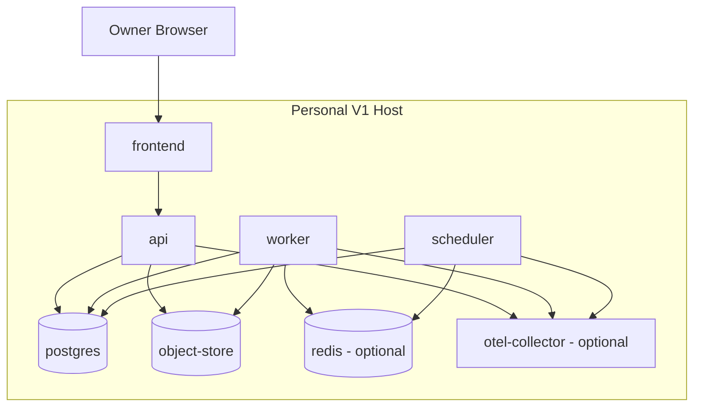

# Investment Intelligence OS
## Process and Deployment Model — v0.1

---

## 1. V1 Deployment Strategy

V1 runs locally or on one controlled host through containers.

The architecture uses a small number of processes rather than one giant process or many independent microservices.

All backend processes are built from the same application version.

---

## 2. Runtime Processes

### Frontend Process

Responsibilities:

- serve the command-center application;
- render governed API data;
- maintain temporary interface state;
- initiate authorized commands;
- display stale, failed, no-trade, and stand-down states.

### API Process

Responsibilities:

- HTTP API;
- authentication and authorization;
- synchronous queries;
- command acceptance;
- validation;
- short-running application services;
- server-sent event or polling status where enabled.

The API must not perform long source ingestions or backtests inside request threads.

### Worker Process

Responsibilities:

- connector retrieval;
- parsing;
- normalization;
- embeddings;
- world-model updates;
- evidence construction;
- agent runs;
- research jobs;
- report generation;
- postmortem jobs.

Workers claim jobs from the durable job ledger.

### Scheduler Process

Responsibilities:

- create scheduled jobs;
- daily briefing workflow;
- source freshness checks;
- market-data refresh;
- post-close reconciliation;
- periodic backup and maintenance triggers.

The scheduler does not own job results.

### Database Process

Responsibilities:

- durable transactional state;
- concurrency control;
- job ledger;
- outbox;
- audit;
- portfolio accounting;
- embeddings through extension support.

### Object-Storage Process

Responsibilities:

- immutable raw payloads;
- large documents;
- research artifacts;
- reports;
- backup exports.

Development may use a local S3-compatible container or a filesystem adapter. The production contract remains object-storage compatible.

### Optional Cache and Lock Process

May provide:

- short-lived cache;
- distributed rate-limit counters;
- ephemeral locks;
- model-response cache where permitted.

It is not a system of record.

### Observability Collector

May receive:

- traces;
- metrics;
- logs.

The application must still emit structured local logs if a collector is unavailable.

---

## 3. Container Topology

---

## 4. Environment Configuration

Each environment has separate:

- database;
- object-storage namespace;
- secrets;
- broker adapter;
- model permissions;
- source credentials;
- logs;
- feature flags;
- environment identifier.

A paper environment must not contain live broker credentials.

---

## 5. Deployment Units

### V1

- one frontend image;
- one backend image used by API, worker, and scheduler;
- one PostgreSQL image with required extensions;
- one object-storage image or external bucket;
- optional cache;
- optional observability collector.

### Future

Processes may scale independently:

- additional workers;
- separate heavy-research workers;
- separate model gateway;
- separate ingestion workers;
- separate read replica;
- separate event broker.

Extraction occurs only after measurement.

---

## 6. Configuration Hierarchy

Configuration precedence:

1. secure runtime secret;
2. environment variable;
3. environment-specific configuration file;
4. application default.

Configuration must be typed and validated at startup.

Critical missing configuration causes startup failure rather than hidden fallback.

---

## 7. Startup Sequence

1. validate environment mode;
2. validate configuration;
3. connect to PostgreSQL;
4. verify schema version;
5. verify required extensions;
6. verify object storage;
7. verify critical source registry;
8. verify risk configuration;
9. verify broker adapter is paper-only in V1;
10. register process health;
11. begin accepting work.

If a critical check fails, API may enter read-only diagnostic mode, but new risk and workflows remain disabled.

---

## 8. Shutdown Sequence

1. stop accepting new jobs;
2. finish or safely release current leases;
3. flush audit events;
4. close external connections;
5. publish unhealthy or stopped state;
6. exit within configured timeout.

A killed worker must leave jobs recoverable through lease expiration.

---

## 9. Process Scaling

Stateless API processes may scale horizontally.

Workers may scale by:

- queue or job type;
- concurrency limit;
- source domain;
- cost class;
- CPU or memory profile.

The scheduler must have leader election or a database lease so duplicate scheduler instances do not create duplicate schedules.

---

## 10. Deployment Safety

Every release must:

- use immutable image tags or digests;
- record code commit;
- run migrations explicitly;
- support rollback;
- preserve audit history;
- verify paper mode;
- run smoke tests;
- verify source and risk health.

---

## 11. Initial Resource Posture

V1 should operate on a developer machine or modest controlled host.

Architecture must prevent expensive defaults:

- unbounded worker concurrency;
- unlimited embeddings;
- unlimited model context;
- unrestricted backtest universes;
- full-document reprocessing on every run;
- duplicate source downloads;
- unnecessary GPU assumptions.

Cost and latency are measured per workflow.

---

## 12. Future Cloud Portability

The architecture avoids hard-coding one cloud provider.

Portable interfaces are used for:

- object storage;
- secrets;
- container runtime;
- logs and metrics;
- scheduled jobs;
- database connection;
- model providers;
- broker providers.

Provider-specific deployment files may exist but may not define domain behavior.

---

## 13. Deployment Acceptance Tests

- clean environment starts from documented commands;
- migrations apply to an empty database;
- previous release can be restored;
- worker crash causes job recovery rather than duplication;
- duplicate scheduler instances do not duplicate a daily workflow;
- paper mode cannot load live credentials;
- critical dependency failure produces unhealthy or stand-down state;
- database restore recreates authoritative state;
- object-store restore reconnects raw and research artifacts.
