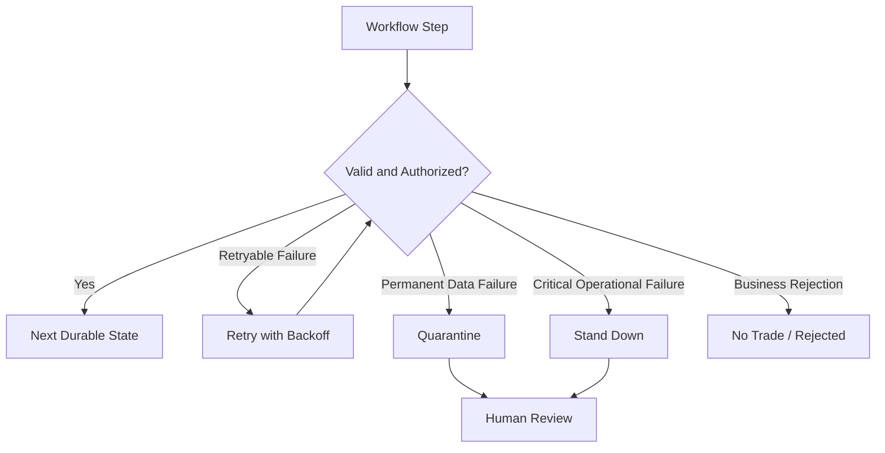

# Investment Intelligence OS
## Data Flow and Event Lifecycle — v0.1

---

## 1. Purpose

This document defines the full lifecycle of information and decisions inside IIOS.

Each stage creates a durable object with explicit status.

---

## 2. Source-to-Decision Flow

```mermaid
flowchart LR
    DISC[Discovered]
    FETCH[Retrieved]
    RAW[Raw Stored]
    PARSE[Parsed]
    NORM[Normalized]
    VALID[Validated]
    RESOLVE[Entities Resolved]
    WORLD[World Model Updated]
    EVID[Evidence Created]
    REASON[Reasoned]
    AGENT[Agents Completed]
    COMMIT[Committee Decided]
    RISK[Risk Reviewed]
    PAPER[Paper Executed]
    MON[Monitored]
    CLOSED[Closed]
    LEARN[Postmortem and Learning]

    DISC --> FETCH --> RAW --> PARSE --> NORM --> VALID
    VALID --> RESOLVE --> WORLD --> EVID --> REASON --> AGENT
    AGENT --> COMMIT --> RISK
    RISK -->|Approved| PAPER --> MON --> CLOSED --> LEARN
    RISK -->|Veto / No Trade| LEARN
```



---

## 3. Raw Record Lifecycle

Statuses:

- `DISCOVERED`
- `FETCHING`
- `STORED`
- `FAILED_RETRIEVAL`
- `QUARANTINED`
- `SUPERSEDED`
- `DELETED_BY_POLICY`

Rules:

- raw content is stored before parsing;
- content hash identifies identical payloads;
- retrieval attempt history is preserved;
- a source correction creates a new raw record or version;
- deletion occurs only under a documented retention or legal rule.

---

## 4. Parse and Normalization Lifecycle

Statuses:

- `PENDING`
- `PARSING`
- `PARSED`
- `NORMALIZED`
- `VALIDATED`
- `FAILED`
- `QUARANTINED`
- `REPROCESS_REQUIRED`

A parser version is recorded.

Reprocessing a raw record creates a new parse result and, if material, a new canonical-object version.

---

## 5. Canonical Event Lifecycle

Statuses:

- `DRAFT`
- `VALIDATED`
- `ACTIVE`
- `REVISED`
- `SUPERSEDED`
- `RETRACTED`
- `QUARANTINED`

An event may represent:

- statement;
- meeting;
- executive action;
- bill action;
- agency action;
- court action;
- sanctions action;
- macro release;
- weather event;
- disease event;
- supply disruption;
- corporate filing;
- earnings event;
- market event.

A meeting event is not automatically an implementation event.

---

## 6. Policy Lifecycle

Policy-related events use explicit stages:

```text
RUMORED
→ DISCUSSED
→ ANNOUNCED_INTENT
→ PROPOSED
→ FORMALLY_ISSUED
→ LEGALLY_EFFECTIVE
→ IMPLEMENTATION_STARTED
→ IMPLEMENTED
→ CHALLENGED
→ STAYED
→ MODIFIED
→ REVERSED
→ EXPIRED
```

Not every policy follows every stage.

The stage is evidence-backed and time-varying.

---

## 7. Evidence and Claim Lifecycle

### Evidence Status

- `ACTIVE`
- `CONTRADICTED`
- `STALE`
- `RETRACTED`
- `QUARANTINED`

### Claim Status

- `PROPOSED`
- `SUPPORTED`
- `CONTESTED`
- `WEAKENED`
- `FALSIFIED`
- `RETIRED`

Claims are classified as:

- fact;
- inference;
- hypothesis.

A claim may have multiple support and contradiction links.

---

## 8. Hypothesis Lifecycle

```text
IDEA
→ REGISTERED
→ EXPLORATORY
→ HISTORICALLY_TESTED
→ VALIDATED_OUT_OF_SAMPLE
→ PAPER_MONITORING
→ PROMOTED
→ REVISED
→ PAUSED
→ REJECTED
→ RETIRED
```

Status changes require a reason and actor.

---

## 9. Thesis Lifecycle

- `DRAFT`
- `AWAITING_EVIDENCE`
- `AWAITING_AGENT_REVIEW`
- `AWAITING_COMMITTEE`
- `CANDIDATE`
- `RISK_REVIEW`
- `APPROVED_FOR_PAPER`
- `VETOED`
- `WATCH`
- `NO_TRADE`
- `OPEN`
- `REDUCED`
- `CLOSED`
- `INVALIDATED`
- `EXPIRED`
- `POSTMORTEM_COMPLETE`

---

## 10. Agent Run Lifecycle

- `QUEUED`
- `RUNNING`
- `COMPLETED`
- `ABSTAINED`
- `FAILED_RETRYABLE`
- `FAILED_PERMANENT`
- `CANCELLED`
- `TIMED_OUT`
- `QUARANTINED`

An agent output is immutable after completion. A correction creates a new run.

---

## 11. Committee Lifecycle

- `CREATED`
- `AWAITING_REQUIRED_VIEWS`
- `READY`
- `DEBATING`
- `REQUESTING_EVIDENCE`
- `DECIDED`
- `NO_TRADE`
- `CANCELLED`
- `SUPERSEDED`

The committee may request another evidence or agent round but is bounded by configured limits.

---

## 12. Risk Lifecycle

- `PENDING`
- `APPROVED`
- `APPROVED_REDUCED`
- `VETOED`
- `EXPIRED`
- `CANCELLED`

A risk approval expires after a configured time or material state change.

---

## 13. Paper Order Lifecycle

```text
CREATED
→ VALIDATED
→ RISK_AUTHORIZED
→ SUBMITTED
→ ACCEPTED
→ PARTIALLY_FILLED
→ FILLED
→ CANCELLED
→ REJECTED
→ EXPIRED
```

Any state transition must be valid for the preceding state.

---

## 14. Learning Lifecycle

An outcome review may produce:

- no belief change;
- confidence increase;
- confidence decrease;
- hypothesis revision;
- agent calibration update;
- strategy pause;
- strategy retirement;
- new missing-information requirement;
- new data-quality rule;
- new risk rule proposal.

Learning does not silently rewrite prior records.

---

## 15. Correlation and Causation IDs

Every workflow carries:

- `correlation_id` — ties related work to one end-to-end operation;
- `causation_id` — identifies the immediate object or event that caused the action;
- `actor_id` — human, service, agent, or scheduler;
- `run_id` — specific execution;
- `version_context` — code, schema, model, and prompt versions.

---

## 16. Failure Routing



---

## 17. Replay Rules

A replay must specify:

- source cutoff;
- target workflow;
- parser version;
- code version;
- whether derived objects will be replaced or versioned;
- whether external calls are allowed;
- whether the run is research, repair, or operational.

Replay may not create duplicate paper trades.

---

## 18. Lifecycle Acceptance Tests

- each object accepts only valid state transitions;
- retries do not duplicate durable effects;
- retracted evidence weakens linked claims;
- policy implementation status can change without erasing prior stages;
- expired risk approval cannot create an order;
- a material world-state change triggers reevaluation;
- no-trade creates a complete journal record;
- reprocessing preserves the old parser result;
- replay reproduces the same result when dependencies and seeds are fixed.
