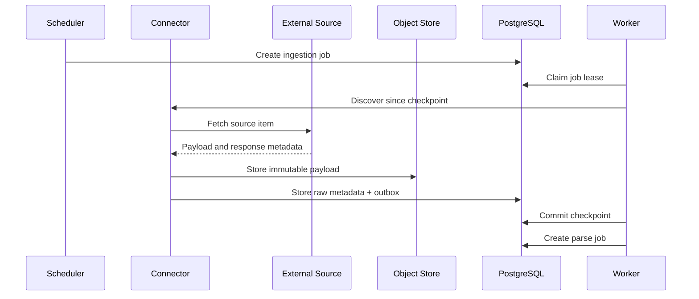

# Investment Intelligence OS
## Connector and Ingestion Architecture — v0.1

---

## 1. Connector Doctrine

A connector retrieves and preserves source data.

A connector does not decide whether an event is bullish, bearish, or investable.

Retrieval, parsing, normalization, and interpretation are separate stages.

---

## 2. Connector Interface

Every connector implements a stable contract conceptually equivalent to:

```python
class Connector:
    connector_id: str
    source_id: str
    schema_version: str

    def discover(self, checkpoint) -> list[SourceItem]: ...
    def fetch(self, item: SourceItem) -> RetrievedPayload: ...
    def checkpoint(self) -> ConnectorCheckpoint: ...
    def health(self) -> SourceHealthAssessment: ...
```

Parsing and normalization use separate interfaces:

```python
class Parser:
    def parse(self, raw_record) -> ParseResult: ...

class Normalizer:
    def normalize(self, parse_result) -> list[CanonicalObject]: ...
```

---

## 3. Source Manifest

Each source requires:

- source ID;
- publisher;
- source class;
- official or licensed status;
- rights notes;
- connector type;
- expected cadence;
- freshness threshold;
- timestamp semantics;
- revision behavior;
- rate limits;
- authentication method;
- raw media types;
- parser owner;
- fallback method;
- criticality;
- retention rule;
- review date.

---

## 4. Ingestion Sequence



Raw storage occurs before downstream interpretation.

---

## 5. Connector Types

Initial supported patterns:

- REST or JSON API;
- RSS or Atom;
- static HTML listing;
- individual HTML page;
- downloadable CSV or JSON;
- XML;
- document repository;
- public filing feed;
- licensed streaming or batch market data;
- manual approved file import.

Browser automation is a last resort and requires explicit review because it is more fragile and may create rights or operational issues.

---

## 6. Initial Source Domains

The first vertical slice should include:

1. presidency or official federal policy;
2. Federal Reserve or macroeconomic source;
3. one non-policy source such as SEC, NOAA, USDA, EIA, CFTC, Treasury, sanctions, trade, or another approved primary source;
4. market prices required to measure reaction and simulate paper execution.

The initial slice is deliberately multi-domain to prevent a single political narrative from controlling the system.

---

## 7. Checkpoints

Connector checkpoint examples:

- last publication timestamp;
- last source ID;
- pagination cursor;
- document sequence;
- ETag;
- Last-Modified value;
- file checksum;
- market-data offset.

Checkpoint advancement occurs only after durable raw storage succeeds.

---

## 8. Idempotency

A raw record identity may combine:

- source ID;
- source-native ID;
- publication time;
- revision ID;
- content hash.

Unique constraints prevent duplicates.

If content changes under the same source-native ID, create a new revision rather than overwrite.

---

## 9. Rate Limits and Backoff

Each connector declares:

- request budget;
- concurrency;
- timeout;
- retryable status classes;
- retry limit;
- exponential backoff;
- jitter;
- cooldown;
- priority.

Rate-limit state may use transient counters but durable failure history remains in PostgreSQL.

---

## 10. Error Classes

- authentication failure;
- authorization or license failure;
- rate limit;
- timeout;
- connection failure;
- source unavailable;
- malformed payload;
- unexpected schema;
- parser failure;
- timestamp ambiguity;
- duplicate;
- prohibited content;
- rights uncertainty;
- object-storage failure;
- database failure.

Error class determines retry, quarantine, stand-down, or permanent failure.

---

## 11. Source Health

Health dimensions:

- reachability;
- freshness;
- retrieval success rate;
- schema stability;
- parse success rate;
- revision frequency;
- latency;
- completeness;
- duplicate rate;
- rights status.

Critical-source health affects risk eligibility.

---

## 12. Parsing Rules

Parsers must:

- preserve original text spans or source offsets where possible;
- record parser version;
- avoid inventing missing fields;
- represent ambiguous time explicitly;
- preserve units and original values;
- normalize time zones;
- store extraction confidence;
- emit warnings;
- support deterministic fixture tests.

LLM-assisted extraction may propose structured fields but requires schema validation and evidence spans.

---

## 13. Normalization Rules

Normalizers map source-specific data into canonical objects.

They must not:

- collapse rhetoric and implementation into one policy state;
- convert missing values into zero;
- infer a company or instrument without confidence;
- treat publication time as occurrence time unless valid;
- discard source-specific metadata needed for audit.

---

## 14. Revision Handling

Revision types:

- correction;
- restatement;
- replacement;
- retraction;
- update;
- implementation status change;
- parser reinterpretation.

The system links versions and triggers review of affected:

- claims;
- world state;
- hypotheses;
- open paper positions;
- research datasets.

---

## 15. News and Narrative Deduplication

Multiple articles may repeat one original report.

IIOS clusters:

- identical URLs;
- syndicated text;
- common quoted source;
- same official release;
- near-duplicate narratives.

Ten copies of one claim do not equal ten independent evidence items.

---

## 16. Manual Import

Manual import requires:

- source selection;
- public or license classification;
- file hash;
- original filename;
- import actor;
- publication and market-available time;
- reason;
- quarantine review when uncertain.

Manual files enter the same raw and normalization pipeline.

---

## 17. Ingestion Acceptance Tests

- duplicate fetch creates one raw identity;
- changed content creates a revision;
- checkpoint does not advance before durable storage;
- rate limit retries safely;
- malformed source is quarantined;
- parser upgrade can replay old raw records;
- source outage appears in source health;
- prohibited provenance is rejected;
- LLM extraction cannot create unsupported fields;
- stale critical source triggers the configured stand-down response.
