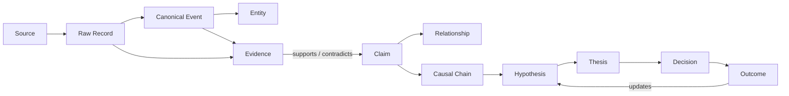

# Investment Intelligence OS
## World Model and Evidence Graph Architecture — v0.1

---

## 1. World Model Purpose

The World Model represents what IIOS currently believes is happening in the economic ecosystem, what evidence supports that belief, how confident it is, and how the state changed over time.

It is not one AI-generated paragraph.

It is a versioned set of entities, relationships, events, state variables, and regime assessments.

---

## 2. World Model Layers

### Entity Layer

Represents:

- people;
- companies;
- sectors;
- governments;
- agencies;
- countries;
- commodities;
- crops;
- livestock;
- diseases;
- weather systems;
- facilities;
- currencies;
- instruments;
- indicators;
- policies.

### Relationship Layer

Examples:

- supplies;
- purchases from;
- regulates;
- sanctions;
- competes with;
- owns;
- finances;
- depends on;
- produces;
- transports;
- substitutes for;
- benefits from;
- is harmed by;
- sensitive to;
- located in;
- exposed to.

### Event Layer

Represents changes and observations.

### State Layer

Represents current or historical conditions:

- policy stage;
- interest-rate regime;
- inflation regime;
- growth regime;
- volatility regime;
- commodity inventory state;
- crop condition;
- disease outbreak state;
- shipping disruption;
- sanctions state;
- company capex state.

### Evidence Layer

Represents why a state or relationship is believed.

---

## 3. World-State Snapshot

A snapshot includes:

- cutoff time;
- environment;
- included source versions;
- entity states;
- active events;
- regime probabilities;
- unresolved contradictions;
- stale domains;
- data-health summary;
- snapshot hash.

Snapshots are immutable.

A new snapshot supersedes, not overwrites, an old snapshot.

---

## 4. Evidence Graph

---

## 5. Evidence Object

An evidence object includes:

- evidence ID;
- source and raw-record IDs;
- source span or field;
- evidence type;
- directness;
- publication and market-available times;
- validity interval;
- trust score;
- data-quality score;
- extraction method;
- extraction confidence;
- rights classification;
- status;
- content hash.

Evidence is atomic enough to attach to a specific claim.

---

## 6. Support and Contradiction

Evidence links may be:

- supports;
- contradicts;
- qualifies;
- supersedes;
- duplicates;
- contextualizes;
- implementation confirmation;
- implementation failure;
- market confirmation;
- market contradiction.

Link strength is recorded separately from source trust.

---

## 7. Policy Representation

A policy object separates:

- public remark;
- announced intent;
- formal instrument;
- legal authority;
- implementation agency;
- effective date;
- implementation status;
- legal challenge;
- congressional dependency;
- funding dependency;
- expiration or review;
- targeted entities, sectors, or countries.

A White House meeting is represented as a meeting event and linked to participants. It does not automatically create a beneficiary relationship.

---

## 8. Market Regime Representation

Regime output is probabilistic.

Dimensions may include:

- growth;
- inflation;
- liquidity;
- policy stance;
- volatility;
- dollar;
- credit;
- commodity;
- risk appetite.

The system stores probabilities, supporting indicators, contradictory indicators, and transition risk.

A single label such as “bull market” is insufficient.

---

## 9. Weather, Agriculture, and Livestock State

The world model represents:

- geography;
- crop calendar;
- planting and harvest stage;
- precipitation;
- temperature;
- drought;
- storm path;
- soil or pasture condition where available;
- crop condition;
- yield expectations;
- inventory;
- herd state;
- disease;
- import and export restrictions;
- substitution;
- logistics.

A weather event becomes market-relevant only through a documented transmission mechanism.

---

## 10. Corporate and Supply-Chain State

The graph may link:

- company to facility;
- facility to geography;
- company to supplier;
- company to customer;
- company to commodity input;
- company to government contract;
- company to capex program;
- company to technology dependency;
- sector to rate sensitivity.

Relationship evidence and validity intervals are required.

---

## 11. Historical Analogs

Analog retrieval uses:

- event type;
- policy stage;
- macro regime;
- market valuation;
- positioning;
- geography;
- sector exposure;
- volatility;
- expected horizon.

An analog record includes similarities and differences.

Similarity alone does not establish causality.

---

## 12. Graph Implementation

V1 implements the evidence graph in PostgreSQL through normalized tables and recursive or indexed queries.

Reasons:

- transactions;
- lineage;
- time filters;
- source permissions;
- lower operational complexity;
- easier joins to portfolio and audit state.

A dedicated graph database remains a deferred decision.

---

## 13. Read Models

Optimized read models may include:

- current event radar;
- entity exposure view;
- policy lifecycle dashboard;
- source-to-thesis lineage;
- causal-chain graph;
- portfolio causal-cluster view;
- historical analog search;
- unresolved contradiction queue.

Read models are rebuildable projections, not independent truth.

---

## 14. World Model Update Rules

An update must:

- cite evidence;
- identify affected entities;
- preserve prior state;
- state confidence;
- state effective and observation time;
- record source and code version;
- publish an update event;
- trigger reevaluation if material.

---

## 15. Materiality

Materiality may consider:

- expected asset impact;
- affected market value;
- novelty;
- implementation probability;
- source directness;
- timing;
- portfolio exposure;
- uncertainty;
- potential tail risk.

Materiality ranking is a prioritization tool, not a trade decision.

---

## 16. Acceptance Tests

- a remark and a signed action remain different states;
- a meeting does not automatically create a beneficiary claim;
- contradictory source attaches to the same claim;
- retracted evidence updates current state without erasing history;
- historical snapshot excludes later relationships;
- stale domain is visible;
- entity merge preserves graph lineage;
- portfolio exposure can be traced to causal clusters;
- analog result shows differences as well as similarities.
