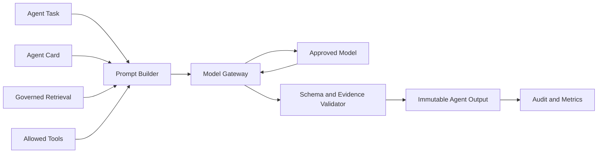
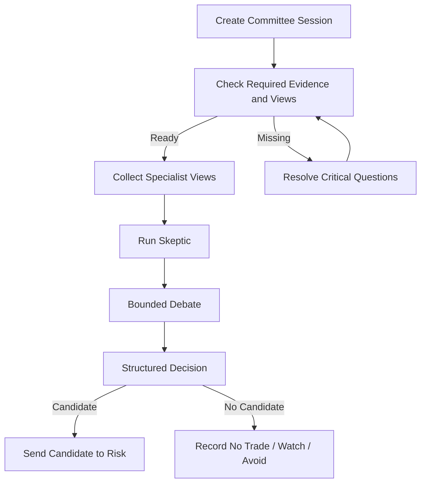

# Investment Intelligence OS
## Agent and Investment Committee Architecture — v0.1

---

## 1. Agent Doctrine

Agents are bounded specialist analysts.

They do not possess unrestricted memory, unrestricted tools, or direct execution authority.

Every agent run is a governed, versioned, auditable computation.

---

## 2. Agent Runtime

---

## 3. Agent Card

Every agent definition includes:

- agent ID;
- name;
- mandate;
- questions it answers;
- prohibited behavior;
- required evidence;
- permitted sources;
- permitted tools;
- output schema;
- abstention rules;
- confidence rubric;
- maximum steps;
- token and cost budget;
- timeout;
- model policy;
- prompt version;
- evaluation suite;
- owner;
- status.

Detailed cards belong in Package 05 — Agent Cards.

---

## 4. Initial Agents

### Policy Analyst

Focus:

- presidency;
- executive actions;
- Congress;
- agencies;
- courts;
- tariffs;
- trade;
- implementation status.

Must distinguish speech, intent, formal action, implementation, and realized effect.

### Macro and Rates Analyst

Focus:

- central bank;
- inflation;
- labor;
- growth;
- liquidity;
- yield curve;
- credit;
- dollar;
- regime.

### Geopolitical Analyst

Focus:

- war;
- sanctions;
- trade routes;
- neighboring-country policy;
- escalation and de-escalation;
- country risk.

### Commodity, Agriculture, Livestock, and Weather Analyst

Focus:

- weather;
- crops;
- livestock disease;
- inventories;
- energy;
- metals;
- seasonality;
- logistics;
- substitution.

### Corporate and Sector Analyst

Focus:

- filings;
- earnings;
- guidance;
- capex;
- customers;
- suppliers;
- valuation;
- sector relationships.

### Market Structure Analyst

Focus:

- trend;
- breadth;
- volatility;
- liquidity;
- options;
- futures curves;
- technical confirmation or contradiction.

### Strategy Research Analyst

Focus:

- public strategies;
- public holdings;
- disclosed trades;
- academic papers;
- observable bot behavior;
- competing strategy explanations.

### Skeptic / Red Team

Focus:

- false causality;
- confirmation bias;
- leakage;
- overfitting;
- crowding;
- missing evidence;
- alternative explanations;
- already-priced risk.

### Risk Manager

Focus:

- deterministic risk results;
- liquidity;
- concentration;
- correlation;
- drawdown;
- portfolio fit.

The AI Risk Manager may explain risk. The deterministic Risk Engine owns enforcement.

---

## 5. Model Gateway

All model calls go through one gateway.

The gateway owns:

- provider adapter;
- model allow-list;
- prompt and model version;
- request redaction;
- source-permission check;
- timeout;
- retry;
- cost;
- token usage;
- structured-output enforcement;
- response storage policy;
- provider error normalization;
- fallback policy.

Agent code does not call provider SDKs directly.

---

## 6. Retrieval

Agent retrieval is:

- time-cutoff aware;
- permission aware;
- entity filtered;
- source filtered;
- evidence linked;
- deduplicated;
- size bounded.

Retrieved context includes evidence IDs and source metadata.

Free-form internet access is not an implicit agent capability.

---

## 7. Tool Permissions

Tools are allow-listed by agent.

Examples:

- search governed evidence;
- query world state;
- retrieve market reaction;
- calculate exposure;
- run an approved event study;
- request a missing-information workflow.

Prohibited by default:

- shell access;
- arbitrary network access;
- secret access;
- direct database writes;
- direct paper order creation;
- risk-policy changes;
- live broker access.

---

## 8. Agent Output

Required common fields:

- agent run ID;
- agent and version;
- thesis or event scope;
- source cutoff;
- view;
- confidence dimensions;
- evidence IDs;
- contradictory evidence;
- assumptions;
- missing information;
- invalidation;
- abstention reason;
- model and prompt version;
- cost and latency.

Outputs are immutable.

---

## 9. Abstention

An agent must abstain when:

- evidence is insufficient;
- required source is stale;
- source rights are uncertain;
- context exceeds safe limits;
- question is outside mandate;
- output cannot be supported;
- model or tool fails critically.

Abstention is scored as correct behavior when appropriate.

---

## 10. Committee Workflow

---

## 11. Committee Decision Contract

The committee returns:

- disposition;
- candidate thesis version;
- rationale;
- strongest supporting evidence;
- strongest contradiction;
- dissent;
- unresolved assumptions;
- confidence dimensions;
- expected lag;
- catalyst;
- invalidation;
- requested risk constraints;
- expiration time;
- no-trade reason where applicable.

It does not return final position size.

---

## 12. Debate Limits

Committee debate is bounded by:

- maximum rounds;
- maximum agent reruns;
- time limit;
- cost limit;
- required evidence improvement per additional round.

A repeated argument without new evidence does not justify another round.

---

## 13. Dissent

Dissent record includes:

- dissenting agent;
- disputed claim or assumption;
- evidence;
- confidence;
- what would resolve the disagreement;
- whether dissent is risk-critical.

Risk-critical dissent may force no-trade or reduced risk.

---

## 14. Model and Prompt Registry

Each active combination records:

- provider;
- model;
- model identifier;
- prompt template;
- tool policy;
- retrieval policy;
- structured schema;
- evaluation version;
- release date;
- retirement date;
- known limitations;
- cost and latency history;
- calibration.

A provider alias such as “latest” is insufficient for reproducible decisions.

---

## 15. Fallback Policy

Model fallback is permitted only when:

- the fallback is approved for the agent;
- output schema is equivalent;
- model change is recorded;
- quality threshold is met;
- cost and latency remain within policy.

Critical committee decisions may choose abstention instead of fallback.

---

## 16. Agent Evaluation

Evaluation dimensions:

- factual support;
- evidence precision;
- unsupported-claim rate;
- counter-case quality;
- calibration;
- abstention quality;
- consistency;
- sensitivity to prompt injection;
- cost;
- latency;
- value over baseline.

---

## 17. Prompt Injection Defense

External text is data, not instruction.

The runtime must:

- delimit retrieved content;
- prohibit external text from changing system rules;
- strip or mark active content;
- avoid executing source-supplied code;
- limit tools;
- validate output;
- detect attempts to request secrets or authority.

---

## 18. Agent Acceptance Tests

- agent cannot call unapproved tool;
- agent cannot create a paper order;
- unsupported citation fails validation;
- prompt injection in a source does not change authority;
- stale evidence triggers abstention or lower confidence;
- committee preserves dissent;
- repeated debate stops at budget;
- model fallback is recorded;
- exact prompt and model version can be reconstructed;
- no-trade is produced when required views are missing.
