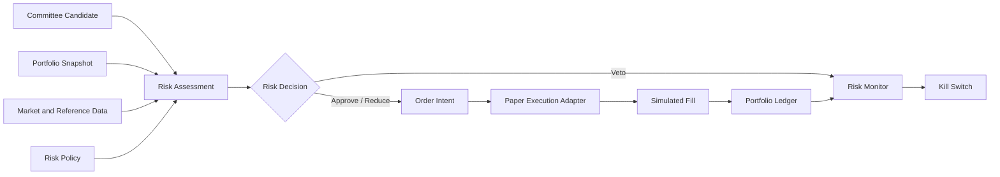

# Investment Intelligence OS
## Portfolio, Risk, and Paper Execution Architecture — v0.1

---

## 1. Prime Directive

Protect capital and preserve the integrity of the experiment.

A good thesis may still be a bad portfolio addition.

The Risk Engine has independent veto authority.

---

## 2. Component Model



---

## 3. Portfolio State

Portfolio module owns:

- account;
- base currency;
- cash;
- reserved cash;
- positions;
- lots;
- realized P&L;
- unrealized P&L;
- fees;
- exposure;
- NAV;
- benchmark state;
- snapshots.

Accounting entries are append-oriented.

Snapshots are derived and reconcilable.

---

## 4. Instrument Support

The canonical architecture supports:

- equities;
- ETFs;
- indexes;
- options;
- futures;
- commodities;
- rates and fixed-income proxies;
- FX;
- cryptocurrencies.

V1 execution adapters may support a smaller subset.

Unsupported instruments produce explicit rejection, not approximate substitution without approval.

---

## 5. Risk Policy

A versioned risk policy includes:

- environment;
- maximum single position;
- maximum theme or causal cluster;
- maximum sector;
- maximum asset class;
- gross exposure;
- net exposure;
- leverage;
- correlation;
- liquidity;
- volatility;
- drawdown;
- event concentration;
- short constraints;
- derivative constraints;
- stale-data rules;
- order expiration;
- kill-switch thresholds;
- override authority.

---

## 6. Risk Assessment Inputs

Risk receives:

- thesis version;
- committee decision;
- current portfolio snapshot;
- current and recent market data;
- instrument metadata;
- liquidity;
- volatility;
- correlation;
- theme and causal clusters;
- scheduled catalysts;
- data health;
- environment mode;
- risk-policy version.

---

## 7. Risk Decision

Possible outcomes:

- `APPROVED`
- `APPROVED_REDUCED`
- `VETOED`
- `WATCH`
- `EXPIRED`

Decision includes:

- maximum notional;
- maximum quantity;
- entry restrictions;
- allowed order type;
- expiration;
- reasons;
- triggered rules;
- required stop or invalidation handling;
- portfolio effect;
- policy version.

---

## 8. Confidence and Size

Confidence does not directly map to leverage.

Sizing considers:

- loss at invalidation;
- volatility;
- liquidity;
- spread;
- gap risk;
- correlation;
- theme concentration;
- existing exposure;
- drawdown state;
- uncertainty;
- execution capacity.

A high-confidence but highly correlated candidate may receive zero size.

---

## 9. Causal-Cluster Risk

Positions are grouped by shared drivers.

Examples:

- one tariff;
- one rate-cut thesis;
- one war escalation;
- one drought;
- one AI data-center capex theme;
- one oil-price direction;
- one dollar direction;
- one company supply chain.

This prevents false diversification across different tickers expressing the same bet.

---

## 10. Paper Order Intent

Order intent includes:

- thesis ID;
- risk-decision ID;
- portfolio;
- instrument;
- side;
- quantity or target exposure;
- order type;
- limit or stop values where applicable;
- time in force;
- valid window;
- expected price;
- execution assumptions;
- environment;
- idempotency key.

---

## 11. Order Validation

Before submission:

- environment is paper;
- thesis remains active;
- risk approval is active;
- source and market data are fresh;
- instrument is tradable in simulator;
- quantity is valid;
- portfolio has sufficient cash or margin model;
- order does not breach current limits;
- lineage is complete;
- kill switch is not active.

---

## 12. Paper Fill Model

Fill simulation may use:

- next eligible quote or bar;
- bid/ask side;
- configurable spread;
- slippage by liquidity and order size;
- commissions and fees;
- partial fills;
- market hours;
- contract multiplier;
- futures roll;
- option expiry;
- crypto continuous calendar.

Fill assumptions are versioned.

---

## 13. Paper Broker Adapter

The paper adapter implements the same internal interface expected of a future broker.

It supports:

- submit;
- cancel;
- replace where modeled;
- query order;
- query fills;
- query positions;
- query account;
- reconcile.

It cannot route live orders.

---

## 14. Order State Machine

```text
CREATED
→ VALIDATED
→ RISK_AUTHORIZED
→ SUBMITTED
→ ACCEPTED
→ PARTIALLY_FILLED
→ FILLED
```

Alternative terminal states:

- `CANCELLED`
- `REJECTED`
- `EXPIRED`

State transitions are validated and audited.

---

## 15. Accounting

Every fill creates balanced portfolio effects.

Examples:

- cash movement;
- position-lot movement;
- fee;
- realized gain or loss;
- reserved amount release.

Accounting must reconcile from the event ledger.

A dashboard calculation is not authoritative accounting.

---

## 16. Position Monitoring

Monitor:

- price;
- unrealized P&L;
- thesis status;
- invalidation conditions;
- catalyst state;
- risk limits;
- correlation;
- theme exposure;
- time horizon;
- stale data;
- event risk.

A thesis invalidation creates an exit-review workflow.

---

## 17. Kill Switches

Kill switches may activate for:

- portfolio drawdown;
- daily loss;
- accounting mismatch;
- stale critical market data;
- risk service failure;
- unexpected live adapter availability;
- duplicate orders;
- abnormal fill behavior;
- security incident;
- missing lineage.

Kill switch stops new risk and may require human resolution.

---

## 18. Options and Futures Controls

When enabled, risk must account for:

- contract multiplier;
- expiry;
- assignment or settlement;
- nonlinear exposure;
- delta and other sensitivities where modeled;
- margin;
- liquidity;
- roll;
- gap risk;
- exercise style;
- underlying calendar.

No derivative support is considered complete without instrument-specific tests.

---

## 19. Crypto Controls

When enabled, risk must account for:

- continuous market;
- venue differences;
- custody or counterparty assumptions in future live use;
- extreme volatility;
- liquidity;
- funding or derivative mechanics where relevant;
- symbol mapping;
- network or venue events.

---

## 20. Risk and Execution Acceptance Tests

- agent output cannot become an order without committee and risk records;
- risk veto prevents order intent;
- expired approval prevents order;
- duplicate order intent creates one paper order;
- fill updates cash and position atomically;
- portfolio ledger reconciles;
- correlated theme limit rejects nominally different tickers;
- stale market data activates no-new-risk behavior;
- paper environment cannot load live broker adapter;
- kill switch blocks new orders;
- derivative multiplier is included in exposure;
- closed trade links to thesis and postmortem.
