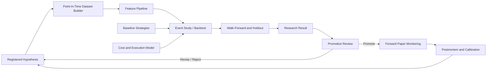

# Investment Intelligence OS
## Research, Backtesting, and Learning Architecture — v0.1

---

## 1. Research Doctrine

Research exists to challenge a hypothesis, not to decorate it.

Every strategy must be compared with a simple baseline and evaluated with information that would have been available at the simulated decision time.

A profitable historical result does not authorize live trading.

---

## 2. Research Separation

Operational and research workloads use the same canonical definitions but different execution contexts.

Research must not:

- alter operational world state;
- create operational paper orders accidentally;
- overwrite production hypotheses;
- use future revisions without explicit labeling;
- mutate risk policies.

Research outputs enter the registry and require promotion.

---

## 3. Research Architecture



---

## 4. Dataset Manifest

Every research dataset receives a manifest containing:

- dataset ID and version;
- purpose;
- source IDs;
- rights classification;
- source retrieval versions;
- market-availability cutoff rules;
- inclusion and exclusion rules;
- entity and instrument universe;
- constituent history;
- corporate-action policy;
- revision policy;
- missing-data policy;
- feature definitions;
- label definitions;
- time range;
- generated time;
- code commit;
- schema versions;
- content hash.

A dataset without a manifest is exploratory only.

---

## 5. Point-in-Time Builder

The builder reconstructs what IIOS could know at each simulated decision time.

It must handle:

- release timestamps;
- source publication lag;
- 13F and public-flow reporting lag;
- macro revisions and vintages;
- index membership history;
- symbol history;
- corporate actions;
- policy implementation stages;
- source corrections;
- timezone and market calendar.

---

## 6. Feature Pipeline

Features are defined independently of strategies.

A feature definition includes:

- feature ID;
- description;
- formula or transformation;
- required sources;
- cutoff rule;
- missing-data rule;
- update cadence;
- version;
- owner;
- leakage test;
- quality metrics.

Examples:

- policy implementation probability;
- change in rate expectations;
- supply disruption severity;
- crop-condition anomaly;
- source novelty;
- sector breadth;
- option-implied volatility;
- public-flow change;
- causal-cluster exposure.

---

## 7. Labels and Outcomes

Outcome definitions must be explicit.

Examples:

- benchmark-adjusted return over one, five, twenty, or sixty sessions;
- maximum favorable excursion;
- maximum adverse excursion;
- realized volatility;
- earnings revision;
- commodity curve change;
- spread change;
- thesis invalidation;
- event implementation success.

The label horizon is chosen before final evaluation.

---

## 8. Event Studies

Event studies must include:

- event definition;
- treatment timestamp;
- deduplication;
- exclusion window;
- benchmark;
- estimation window;
- event window;
- overlapping-event handling;
- concurrent-event controls;
- sample size;
- distribution, not only average;
- regime breakdown;
- sensitivity analysis.

---

## 9. Strategy Interface

A strategy conceptually implements:

```python
class Strategy:
    strategy_id: str
    version: str

    def eligible_universe(self, context): ...
    def generate_signals(self, as_of, data): ...
    def construct_targets(self, signals, portfolio): ...
    def exit_rules(self, position, context): ...
```

The strategy does not bypass portfolio and risk interfaces.

---

## 10. Baselines

Required baselines may include:

- cash;
- broad index;
- equal-weight universe;
- simple trend;
- simple mean reversion;
- sector benchmark;
- buy-and-hold instrument;
- random or shuffled timing test where appropriate.

Complexity must show value over relevant baselines after costs.

---

## 11. Test Separation

Use:

- development or train period;
- validation period;
- final holdout;
- rolling or expanding walk-forward;
- forward paper period.

Repeated use of the final holdout converts it into a development set and requires a new holdout.

---

## 12. Cost Model

Research includes:

- spread;
- commissions;
- fees;
- slippage;
- market impact approximation;
- borrow or short assumptions where relevant;
- futures roll;
- option spread and decay where relevant;
- turnover;
- capacity.

Show gross and net results.

---

## 13. Backtest Outputs

At minimum:

- cumulative return;
- benchmark return;
- volatility;
- maximum drawdown;
- recovery time;
- hit rate;
- average win and loss;
- payoff ratio;
- turnover;
- exposure;
- concentration;
- capacity estimate;
- performance by regime;
- performance by asset class;
- performance by confidence bucket;
- parameter sensitivity;
- worst periods;
- number of observations;
- cost sensitivity.

Avoid relying on one ratio.

---

## 14. Strategy Reverse Engineering

Public bot or investor research follows:

```text
observable actions
→ possible strategy families
→ competing explanations
→ reconstructed rules
→ historical test
→ robustness test
→ forward paper test
```

The architecture records what is unknown:

- hidden hedges;
- exact execution;
- unavailable positions;
- capital constraints;
- tax considerations;
- reporting delay;
- discretionary overrides.

---

## 15. Scenario Simulator

Scenarios may be:

- historical replay;
- deterministic shock;
- probabilistic path;
- policy implementation branch;
- war escalation or de-escalation;
- weather shock;
- rate shock;
- liquidity shock;
- correlation spike;
- data outage;
- execution failure.

Scenario output includes portfolio impact and model assumptions.

---

## 16. Reproducibility Manifest

Every research run records:

- strategy version;
- dataset manifest;
- feature versions;
- parameters;
- random seed;
- code commit;
- environment;
- dependency lock hash;
- cost model;
- benchmark;
- start and end;
- output hash;
- runtime;
- warnings;
- failed checks.

---

## 17. Promotion Rules

A strategy cannot move to forward paper monitoring until it passes:

- point-in-time test;
- leakage review;
- baseline comparison;
- out-of-sample evaluation;
- cost sensitivity;
- parameter sensitivity;
- regime analysis;
- drawdown review;
- reproducibility;
- risk review.

Promotion decision is recorded.

---

## 18. Learning Architecture

Learning inputs:

- paper P&L;
- benchmark-relative outcomes;
- whether causal steps occurred;
- whether catalyst occurred;
- whether invalidation occurred;
- agent confidence;
- committee confidence;
- source quality;
- execution quality;
- market regime;
- data and operational incidents.

Learning outputs:

- agent calibration;
- strategy calibration;
- source trust update;
- hypothesis revision;
- new falsifier;
- new data requirement;
- new risk proposal;
- retirement.

---

## 19. Process Quality Versus Outcome

Postmortem categories:

| Process | Outcome | Interpretation |
|---|---|---|
| Good | Good | Potential skill; continue testing |
| Good | Bad | Expected variance or missing factor; inspect |
| Poor | Good | Luck; do not promote |
| Poor | Bad | Failure; correct or retire |

---

## 20. Research Acceptance Tests

- future revision is excluded from historical feature;
- reporting lag is preserved;
- failed strategy remains in history;
- gross and net performance are both shown;
- final holdout is not used for tuning;
- duplicate events do not inflate sample;
- benchmark is present;
- parameter perturbation is tested;
- research run is reproducible from manifest;
- research environment cannot create operational orders;
- public strategy reconstruction displays unknowns;
- paper learning updates confidence without rewriting history.
