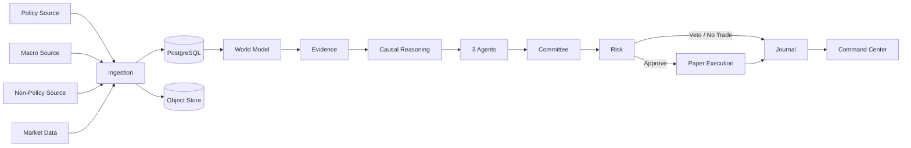

# Investment Intelligence OS
## Seven-Day Vertical Slice Architecture — v0.1

---

## 1. Objective

In seven focused build days, prove one complete, auditable, paper-only workflow.

The goal is not full source breadth or sophisticated prediction.

The goal is a working system skeleton that can learn.

---

## 2. Scope

The slice includes:

- one official presidency or policy source;
- one Federal Reserve or macro source;
- one non-policy official source;
- one market-data adapter;
- canonical raw and event records;
- entity resolution;
- evidence and claims;
- one causal chain and counter-chain;
- Policy Analyst;
- Macro Analyst;
- Skeptic;
- committee;
- deterministic risk;
- paper order or no-trade;
- paper portfolio;
- journal;
- minimal command center;
- golden-trace test.

---

## 3. Slice Architecture



---

## 4. Day 1 — Foundation

Deliver:

- repository structure;
- backend package;
- typed configuration;
- Docker Compose;
- PostgreSQL;
- object storage;
- migrations;
- health endpoint;
- environment mode;
- audit skeleton;
- job ledger;
- tests.

Acceptance:

- application starts;
- paper mode is explicit;
- migration creates database;
- raw object can be stored and retrieved;
- job can be created and completed;
- no secret is committed.

---

## 5. Day 2 — Ingestion

Deliver:

- source registry;
- connector contract;
- policy connector;
- macro connector;
- non-policy connector;
- raw record;
- parser;
- canonical event;
- source health;
- deduplication;
- revision handling.

Acceptance:

- each connector preserves raw payload;
- duplicate retrieval is idempotent;
- publication and market-available times exist;
- malformed fixture quarantines;
- source health is queryable.

---

## 6. Day 3 — Knowledge and Reasoning

Deliver:

- entity registry;
- entity aliases;
- event-to-entity links;
- world-state snapshot;
- evidence object;
- claim;
- causal chain;
- counter-chain;
- missing-information list;
- explainability packet skeleton.

Acceptance:

- one event has complete source-to-claim lineage;
- a policy remark and formal action are distinct;
- counter-chain is required;
- ambiguous entity match is not silently finalized.

---

## 7. Day 4 — Agents and Committee

Deliver:

- model gateway;
- agent definition;
- Policy Analyst;
- Macro Analyst;
- Skeptic;
- structured agent outputs;
- committee session;
- dissent;
- candidate or no-trade decision.

Acceptance:

- model calls are versioned;
- citations are validated;
- prompt injection fixture fails safely;
- agent can abstain;
- committee preserves disagreement;
- no-trade path works.

---

## 8. Day 5 — Portfolio, Risk, and Paper

Deliver:

- paper account;
- cash;
- instrument;
- position;
- risk policy;
- risk assessment;
- risk veto;
- order intent;
- paper order;
- simulated fill;
- accounting;
- portfolio snapshot;
- kill switch.

Acceptance:

- no order without risk approval;
- duplicate intent creates one order;
- fill reconciles cash and position;
- stale market data blocks new risk;
- paper mode cannot call live adapter.

---

## 9. Day 6 — Research and Command Center

Deliver:

- event-study skeleton;
- simple benchmark;
- research manifest;
- daily briefing API;
- command-center page;
- event radar;
- decision detail;
- portfolio panel;
- system-health panel.

Acceptance:

- event study uses point-in-time cutoff;
- dashboard displays source cutoff;
- decision links to evidence;
- risk veto and no-trade are visible;
- paper mode is visible.

---

## 10. Day 7 — Golden Trace and Hardening

Deliver:

- end-to-end golden fixture;
- failure-path tests;
- logs and correlation;
- backup;
- restore test;
- release manifest;
- engineering log;
- initial postmortem.

Acceptance:

- one trace reconstructs every durable object;
- worker crash is recoverable;
- duplicate event is harmless;
- backup restores the trace;
- critical failure activates stand-down;
- all P0 tests pass.

---

## 11. Golden Scenario

The golden scenario should use a lawful public event that has:

- clear publication time;
- identifiable entities;
- plausible macro or sector mechanism;
- available market reaction;
- a credible counter-case;
- enough information to create either a tiny paper candidate or no-trade.

The exact investment outcome is less important than complete lineage.

---

## 12. Slice Non-Goals

Do not add during the seven days unless required for the trace:

- dozens of connectors;
- multiple brokers;
- live execution;
- mobile app;
- multi-user billing;
- dedicated graph database;
- distributed event broker;
- complex options engine;
- automated strategy discovery;
- large-scale model training;
- polished public website.

---

## 13. Completion Rule

The vertical slice is complete only when a user can open one decision and trace:

```text
source
→ raw data
→ event
→ entities
→ evidence
→ reasoning
→ agent views
→ committee
→ risk
→ paper outcome or no-trade
→ learning
```

A collection of disconnected demos does not satisfy the slice.
