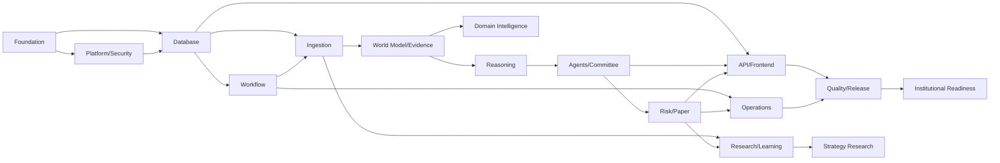

# Dependency Map

```mermaid
flowchart LR
    E01[Foundation] --> E02[Platform/Security]
    E01 --> E03[Database]
    E02 --> E03
    E03 --> E04[Workflow]
    E03 --> E05[Ingestion]
    E04 --> E05
    E05 --> E06[World Model/Evidence]
    E06 --> E07[Reasoning]
    E07 --> E08[Agents/Committee]
    E08 --> E09[Risk/Paper]
    E05 --> E10[Research/Learning]
    E09 --> E10
    E06 --> E11[Domain Intelligence]
    E03 --> E12[API/Frontend]
    E08 --> E12
    E09 --> E12
    E04 --> E13[Operations]
    E09 --> E13
    E12 --> E14[Quality/Release]
    E13 --> E14
    E10 --> E15[Strategy Research]
    E14 --> E16[Institutional Readiness]
```

Ticket-level dependency IDs inside the individual tickets are authoritative.
